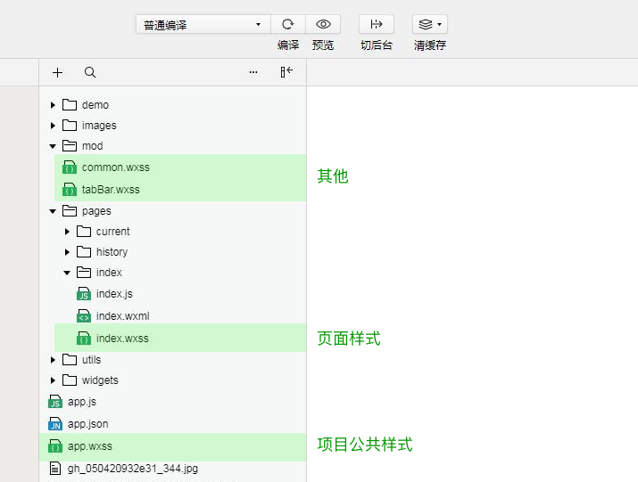
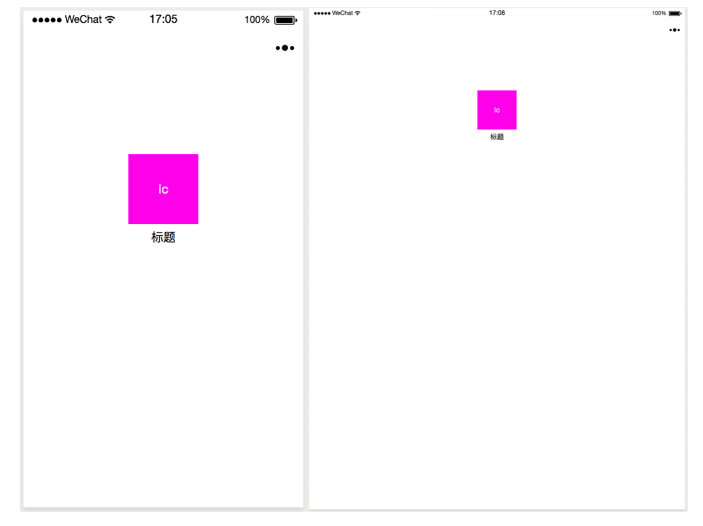
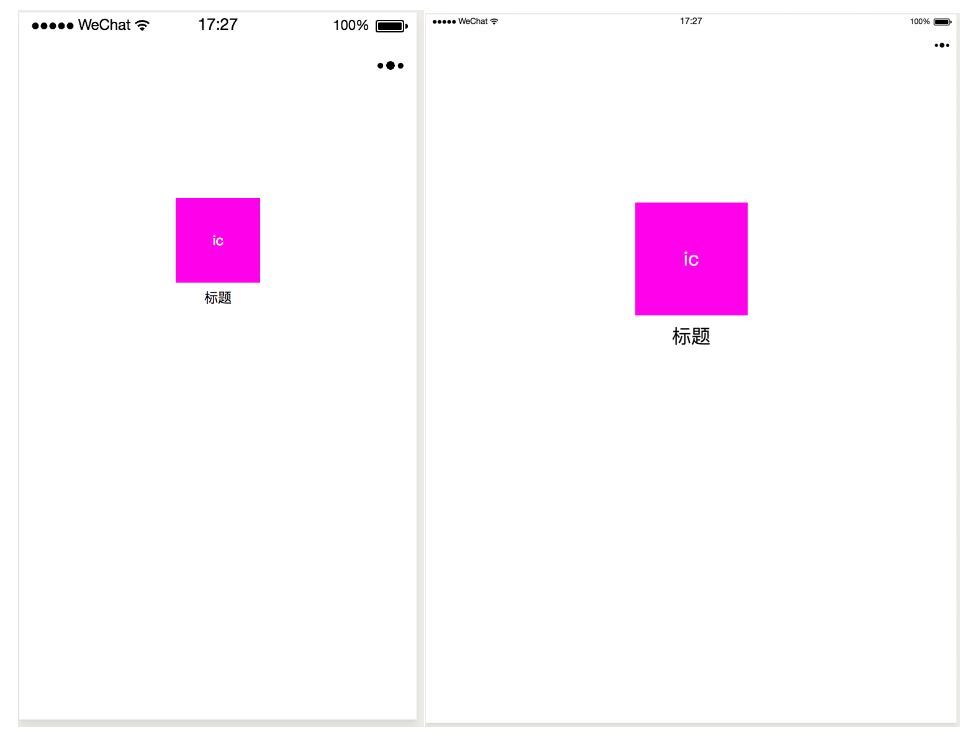
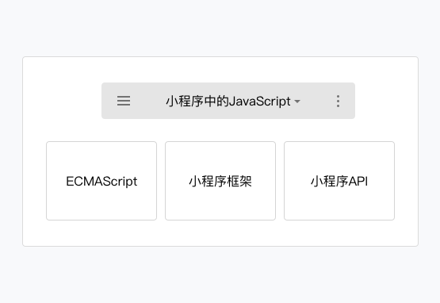
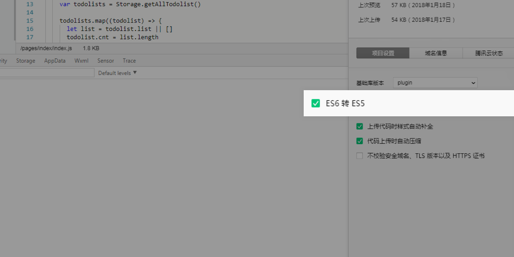

##小程序开发指南之小程序代码组成

### 小程序介绍与开发环境
 小程序是一种全新的连接用户与服务的方式，它可以在**微信内被便捷地获取和传播**，同时具有**出色的使用体验**。任何一个普通的开发者，经过简单的学习和练习后，都可以轻松地完成一个小程序的开发和发布。
 -----
 
#### 1.小程序与普通网页开发的区别
  
>  小程序的主要开发语言是 **JavaScript** ，所以通常小程序的开发会被用来同普通的网页开发来做对比。两者有**很大的相似性**，对于前端开发者而言，从网页开发迁移到小程序的开发成本并不高，但是二者还是**有些许区别**的。
>  
>  ​ 网页开发**渲染线程**和**脚本线程**是互斥的，这也是为什么长时间的脚本运行可能会导致页面失去响应，而在**小程序中，二者是分开**的，分别运行在不同的进程中。
>  网页开发者可以使用到各种浏览器暴露出来的 DOM API，进行 DOM 选中和操作。而如上文所述，**小程序的逻辑层和渲染层是分开的**，逻辑层运行在 JSCore 中，并没有一个完整浏览器对象，因而缺少相关的DOM API和BOM API。这一区别导致了前端开发非常熟悉的一些库，例如 jQuery、 Zepto 等，在小程序中是无法运行的。同时 JSCore 的环境同 NodeJS 环境也是不尽相同，所以一些 NPM 的包在小程序中也是无法运行的。

-----
#### 1.1小程序运行的环境
| 运行环境	     |     逻辑层 |   渲染层|
| :-------- | --------:| :------: |
| IOS    |   JavaScriptCore |  WKWebView  |
| 安卓    |   X5 JSCore |  X5浏览器  |
| 小程序开发者工具    |   NWJS |  Chrome WebView  |

----
#### 1.2小程序的特色

​ 对于普通用户，小程序实现了应用的触手可及，只需要通过**扫描二维码**、**搜索**或者是**朋友的分享**就可以直接打开，加上优秀的体验，小程序使得服务提供者的触达能力变得更强。

--------

### 2.小程序代码组成

​ 小程序由**配置代码JSON文件**、**模板代码 WXML 文件**、样**式代码 WXSS文件**以及**逻辑代码 JavaScript文件**组成。

------

#### 2.1 JSON

##### 2.1.1 JSON 配置

SON 是一种数据格式，并不是编程语言，在小程序中，JSON扮演的静态配置的角色。

##### 2.1.2 JSON语法

相比于XML ，JSON格式最大的优点是易于人的阅读和编写，通常不需要特殊的工具，就能读懂和修改，是一种轻量级的数据交换格式。

JSON文件都是被包裹在一个大括号中 {}，通过key-value的方式来表达数据。

​ JSON的Key必须包裹在一个双引号中，在实践中，编写 JSON 的时候，忘了给 Key 值加双引号或者是把双引号写成单引号是常见错误。

​ **JSON的值只能是以下几种数据格式**：

- 数字，包含浮点数和整数
- 字符串，需要包裹在双引号中
- Bool值，true 或者 false数组，需要包裹在方括号中 []
- 对象，需要包裹在大括号中 {}
- Null

​ 其他任何格式都会触发报错，例如 JavaScript 中的 undefined 。

----------------

### 2.3 WXSS 样式

​ WXSS（WeiXin Style Sheets）是一套用于小程序的样式语言，用于描述WXML的组件样式，也就是视觉上的效果。

​ WXSS与Web开发中的CSS类似。为了更适合小程序开发，WXSS对CSS做了一些补充以及修改。

-----------------
#### 2.3.1 尺寸单位

在WXSS中，引入了**rpx**（responsive pixel）尺寸单位。引用新尺寸单位的目的是，**适配不同宽度的屏幕**，开发起来更简单。

​ 如图2-9所示，同一个元素，在不同宽度的屏幕下，**如果使用px为尺寸单位，有可能造成页面留白过多**。

修改为rpx尺寸单位
  

--------------

#### 2.3.2 wxss的引入

由于WXSS最终会被编译打包到目标文件中，用户**只需要下载一次**，在使用过程中不会因为样式的引用而产生多余的文件请求。

-----------------

### 2.4 JavaScript 脚本
小程序的主要开发语言是 JavaScript ，开发者使用 JavaScript 来开发业务逻辑以及调用小程序的 API 来完成业务需求。

​ 小程序中的 JavaScript 是由ECMAScript 以及小程序框架和小程序 API 来实现的。同浏览器中的JavaScript 相比没有 BOM 以及 DOM 对象，所以类似 JQuery、Zepto这种浏览器类库是无法在小程序中运行起来的，同样的缺少 Native 模块和NPM包管理的机制，小程序中无法加载原生库，也无法直接使用大部分的 NPM 包。

------------------
####  2.4.1 小程序的执行环境

 明白了小程序中的 JavaScript 同浏览器以及NodeJS有所不同后，开发者还需要注意到另外一个问题，不同的平台的小程序的脚本执行环境也是**有所区别的**。
 
**小程序目前可以运行在三大平台**：
- iOS平台，包括iOS9、iOS10、iOS11
- Android平台
- 小程序IDE

这种区别主要是体现三大平台实现的 ECMAScript 的标准有所不同。

目前开发者大部分使用的是 ECMAScript 5 和 ECMAScript 6 的标准，但是在小程序中， iOS9和iOS10 所使用的运行环境并没有完全的兼容到 ECMAScript 6 标准，一些 ECMAScript 6 中规定的语法和关键字是没有的或者同标准是有所不同的。

例如：
- 箭头函数
- let const
- 模板字符串
- …

小程序IDE提供语法转码工具帮助开发者，将 ECMAScript 6代码转为 ECMAScript 5代码，从而在所有的环境都能得到很好的执行。

**开发者需要在项目设置中，勾选 ES6 转 ES5 开启此功能。**

--------------------
#### 2.4.2 模块化
​ 浏览器中，所有 JavaScript 是在运行在同一个作用域下的，定义的参数或者方法可以被后续加载的脚本访问或者改写。同浏览器不同，小程序中可以将任何一个JavaScript 文件作为一个模块，通过**module.exports** 或者 **exports** **对外暴露接口。**

----------
